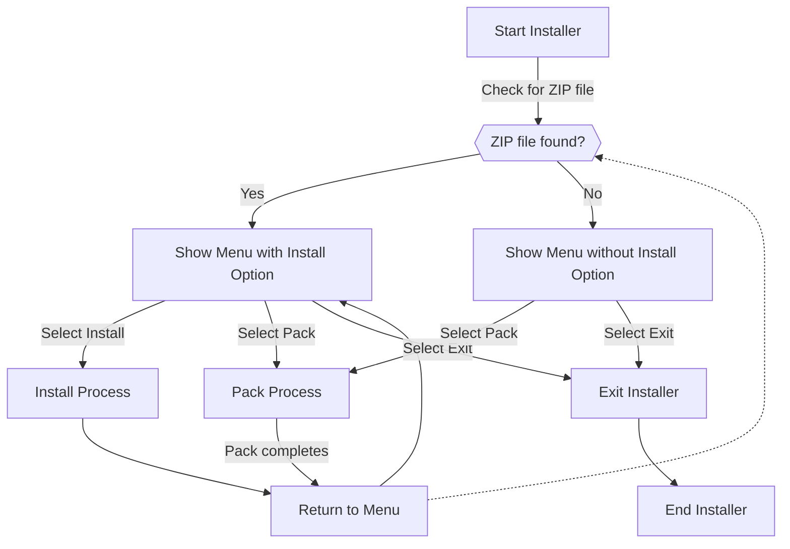

I hate that I don't document things. Not in an abstract "we should write more ADRs" way — in the *I am staring at my own repo and it might as well be someone else's* way.

This post is part rant, part therapy, part **actual spec** for a thing called `simple-installer` because if I don't write it down here, nobody will, including future me.

## The project

It was just a small simple project: a simple installer tool called `simple-installer`. Pack a zip with metadata, install it. Nothing fancy.

It just needed to be able to:

- [x] Pack a zip
- [x] Unpack a zip
- [x] Run as a CLI tool
- [x] Be distributed through NuGet
- [ ] Run as a `dotnet` global tool

## The problem

I got a lot done. Menus, zip in, zip out, CLI, NuGet. Then I hit "global tool" and realized I had **no idea** what to do next — and no breadcrumbs for how I got here in the first place.

It's not perfect, but parts work. The problem is continuity: I don't remember the decisions, and there is no documentation. No specs, no issues, no "why we chose this" anywhere except inside my skull, which is a terrible persistence layer.

## The solution

Write this blog post and treat it as living documentation for the rest of the project. Yes, that is a ridiculous place for specs. It is still better than nowhere.

## Let's get started

### The problem we are trying to solve (the specs)

Installers are unnecessary complex, and they usually have a lot of features that are not needed. So we want to make a simple installer tool that can do the following: Install a program, uninstall a program, update a program, and list installed programs.

### The design

We want to make a CLI tool that can be used to install, uninstall, update and list installed programs. We want to make it as simple as possible, so we will use a simple zip file as the package format. The zip file will contain a `manifest.json` file that will contain the metadata for the package, and the files that will be installed.

#### Menu flow



> [!NOTE]
> Use Chat Gpt-4 to generate some C# code

```c#
using System;
using System.IO;
using Spectre.Console;

class Program
{
    static void Main(string[] args)
    {
        Func<bool> isZipFilePresent = () => File.Exists("yourfile.zip");
        Action showMenu = () => ShowMenuWithSpectre(isZipFilePresent());

        showMenu();
    }

    static void ShowMenuWithSpectre(bool isZipPresent)
    {
        var cmd = AnsiConsole.Prompt(
            new SelectionPrompt<string>()
                .Title("Choose an [green]option[/]:")
                .AddChoices(new[] { "Pack", "Exit" })
                .AddChoiceIf(isZipPresent, "Install"));

        switch (cmd)
        {
            case "Pack":
                Pack();
                break;
            case "Exit":
                Exit();
                break;
            case "Install":
                if (isZipPresent)
                {
                    Install();
                }
                break;
        }
    }

    static void Pack()
    {
        AnsiConsole.MarkupLine("[yellow]Packing...[/]");
        // Packing logic here
    }

    static void Install()
    {
        AnsiConsole.MarkupLine("[green]Installing...[/]");
        // Installation logic here
    }

    static void Exit()
    {
        AnsiConsole.MarkupLine("[red]Exiting...[/]");
        Environment.Exit(0);
    }
}
```
