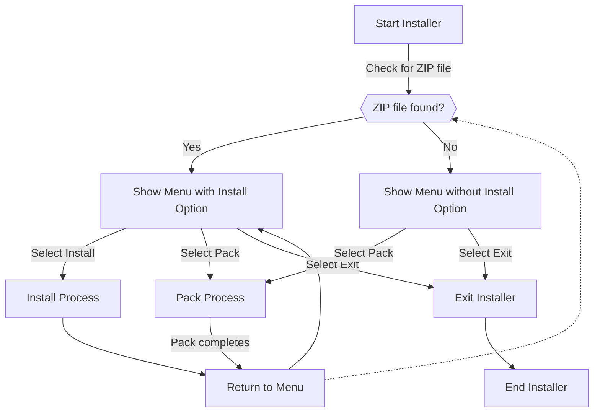

# Why I hate that I don't document things

A story about how I was 75% done with a project, and then I realized I had no idea what to do next.

## The project

It was just a small simple project, just a simple installer tool called simply `simple-installer`. It was supposed to be a simple tool that would pack a zip with some metadata and install it.

It just needed to be able to:
-[X] Pack a zip
-[X] Unpack a zip
-[X] Run as a CLI tool
-[X] Be distributed through NuGet
-[ ] Be able to run as a dotnet tool (global tool)

## The problem

I got a lot done, had some menu options, could pack a zip, could unpack a zip, could run as a CLI tool. But then I realized I had no idea how to distribute it as a dotnet tool. And its not perfect, but I got it working, yet it need some more work.

How do I do this work? I have no idea, I don't remember what I did, and I don't have any documentation. No specs or anything like a an issue on github.

## The solution

Write this blog post, and document the rest of the project. And then this can be the specs and documentation for the project.

## Lets get started

### The problem we are trying to solve (the specs)

Installers are unnecessary complex, and they usually have a lot of features that are not needed. So we want to make a simple installer tool that can do the following: Install a program, uninstall a program, update a program, and list installed programs.

### The design

We want to make a CLI tool that can be used to install, uninstall, update and list installed programs. We want to make it as simple as possible, so we will use a simple zip file as the package format. The zip file will contain a `manifest.json` file that will contain the metadata for the package, and the files that will be installed.

#### Menu flow



> [!NOTE]
> Use Chat Gpt-4 to generate some C# code

```c#
using System;
using System.IO;
using Spectre.Console;

class Program
{
    static void Main(string[] args)
    {
        Func<bool> isZipFilePresent = () => File.Exists("yourfile.zip");
        Action showMenu = () => ShowMenuWithSpectre(isZipFilePresent());

        showMenu();
    }

    static void ShowMenuWithSpectre(bool isZipPresent)
    {
        var cmd = AnsiConsole.Prompt(
            new SelectionPrompt<string>()
                .Title("Choose an [green]option[/]:")
                .AddChoices(new[] { "Pack", "Exit" })
                .AddChoiceIf(isZipPresent, "Install"));

        switch (cmd)
        {
            case "Pack":
                Pack();
                break;
            case "Exit":
                Exit();
                break;
            case "Install":
                if (isZipPresent)
                {
                    Install();
                }
                break;
        }
    }

    static void Pack()
    {
        AnsiConsole.MarkupLine("[yellow]Packing...[/]");
        // Packing logic here
    }

    static void Install()
    {
        AnsiConsole.MarkupLine("[green]Installing...[/]");
        // Installation logic here
    }

    static void Exit()
    {
        AnsiConsole.MarkupLine("[red]Exiting...[/]");
        Environment.Exit(0);
    }
}
```